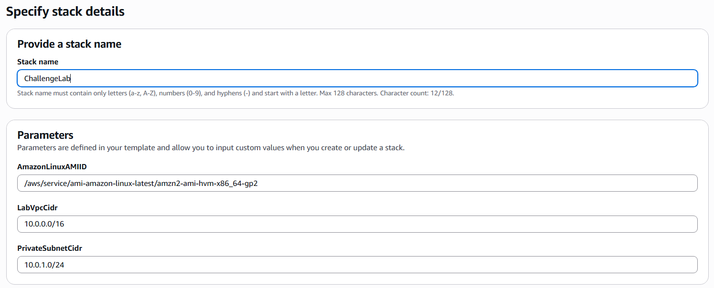
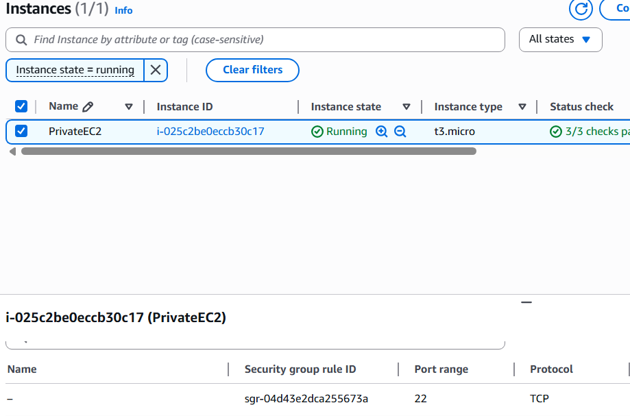
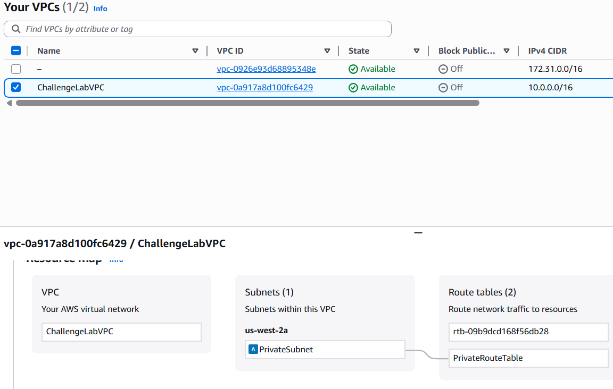

# Lab 15 – Using AWS CloudFormation to Create an AWS VPC and EC2 Instance

## 📘 **Overview**

This lab provides hands-on experience in designing and deploying foundational AWS infrastructure using **AWS CloudFormation**. The goal is to define a **VPC**, **subnet**, **Internet gateway**, **security group**, and **EC2 instance** as code, and to deploy the template successfully through the AWS Management Console.

The exercise reinforces key **Infrastructure as Code (IaC)** principles — automation, repeatability, and consistency — in building and maintaining AWS environments.

---

## 🎯 **Goal**

Create a CloudFormation template that includes:

- An **Amazon Virtual Private Cloud (VPC)**
- An **Internet Gateway (IGW)** attached to the VPC
- A **private subnet** within the VPC
- **Security groups** configured to allow inbound SSH from anywhere (for lab validation)
- An **Amazon EC2 instance** (`t3.micro`) launched in the private subnet

📌 | It is **not necessary** to connect to the EC2 instance via SSH or Remote Desktop for this lab to be considered complete.

📌 | The objective is to ensure the **CloudFormation template deploys successfully** without errors.

## Architecture


---

## 🛠️ **Steps Performed**

### Step 1: Access the AWS Management Console

1. Click **Start Lab** at the top of the lab instructions.
2. Wait until the message **“Lab status: in creation”** appears, then close the Start Lab panel.
3. Click **AWS** at the top of the instructions to open the **AWS Management Console** in a new browser tab.

📌 | If a new tab doesn’t open, allow pop-ups in your browser settings.

📌 | Keep the console and lab instructions side by side for easy reference.

---

### Step 2: Prepare to Use CloudFormation

1. In the AWS Console, open the **CloudFormation** service.
2. Choose **Create stack → With new resources (standard)**.
3. Under *Specify template*, select **Template is ready → Upload a template file**.
4. Upload your CloudFormation YAML file (e.g., C`halleLab.yaml`).


---

### Step 3: Write or Review the CloudFormation Template

The template must include all components defined in the goal section.

Below is a **reference structure** you can use or adapt:

```yaml
AWSTemplateFormatVersion: 2010-09-09
Description: Challenge Lab - VPC with Private Subnet, Internet Gateway, and EC2 Instance

Parameters:
  AmazonLinuxAMIID:
    Type: AWS::SSM::Parameter::Value<AWS::EC2::Image::Id>
    Default: /aws/service/ami-amazon-linux-latest/amzn2-ami-hvm-x86_64-gp2

Resources:

  # VPC
  LabVPC:
    Type: AWS::EC2::VPC
    Properties:
      CidrBlock: 10.0.0.0/20
      EnableDnsSupport: true
      EnableDnsHostnames: true
      Tags:
        - Key: Name
          Value: Lab VPC

  # Internet Gateway and Attachment
  IGW:
    Type: AWS::EC2::InternetGateway
    Properties:
      Tags:
        - Key: Name
          Value: Lab IGW

  AttachIGW:
    Type: AWS::EC2::VPCGatewayAttachment
    Properties:
      InternetGatewayId: !Ref IGW
      VpcId: !Ref LabVPC

  # Private Subnet
  PrivateSubnet:
    Type: AWS::EC2::Subnet
    Properties:
      VpcId: !Ref LabVPC
      CidrBlock: 10.0.1.0/24
      MapPublicIpOnLaunch: false
      AvailabilityZone: !Select [0, !GetAZs '']
      Tags:
        - Key: Name
          Value: Private Subnet

  # Security Group
  LabSecurityGroup:
    Type: AWS::EC2::SecurityGroup
    Properties:
      GroupDescription: Allow SSH from anywhere
      VpcId: !Ref LabVPC
      SecurityGroupIngress:
        - IpProtocol: tcp
          FromPort: 22
          ToPort: 22
          CidrIp: 0.0.0.0/0
      Tags:
        - Key: Name
          Value: SSH Security Group

  # EC2 Instance
  LabInstance:
    Type: AWS::EC2::Instance
    Properties:
      ImageId: !Ref AmazonLinuxAMIID
      InstanceType: t3.micro
      SubnetId: !Ref PrivateSubnet
      SecurityGroupIds:
        - !Ref LabSecurityGroup
      Tags:
        - Key: Name
          Value: Challenge Instance

```

📌 | This template is redacted — no sensitive details or real IPs are included.

📌 | You may extend this with additional outputs or route tables if needed.

---

### Step 4: Configure Stack Details

1. Enter a **Stack name** (e.g., `ChallengeLab`).



1. Leave all parameters at default.
2. Click **Next** through options and permissions screens.
3. Acknowledge **IAM resource creation**, then choose **Create stack**.

---

### Step 5: Monitor Stack Creation

1. Wait until the stack status changes to **CREATE_COMPLETE**.
2. Open the **Resources** and **Outputs** tabs to verify successful deployment.
    
    
    

📌 | If stack creation fails, use the **Events** tab to identify and resolve template errors.

---

### Step 6: Validate Resources (Optional)

You can use the AWS CLI to verify resources:

```bash
aws ec2 describe-vpcs
aws ec2 describe-subnets
aws ec2 describe-instances

```






📌 | These commands confirm that the CloudFormation stack successfully deployed all required components or you could check them in the console manually.

---

## 📝 **Key Takeaways**

- CloudFormation automates the creation of multiple AWS resources through a single YAML or JSON template.
- Using IaC reduces manual setup errors and increases deployment consistency.
- Even “private” subnets can host EC2 instances for internal workloads.
- Security groups define the exposure level of your infrastructure — review ingress rules carefully.
- A successful stack build confirms proper resource dependency and syntax in your template.