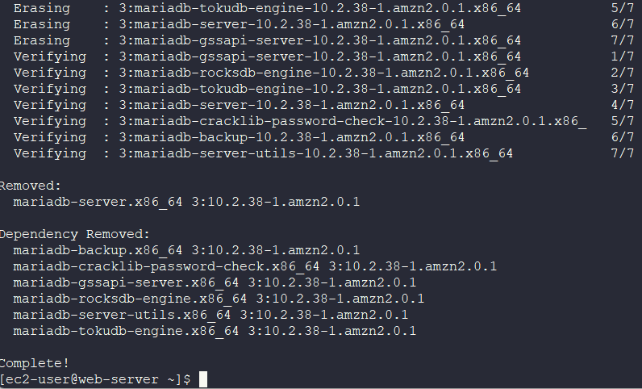
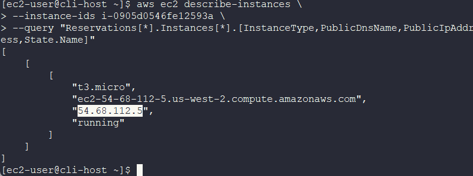
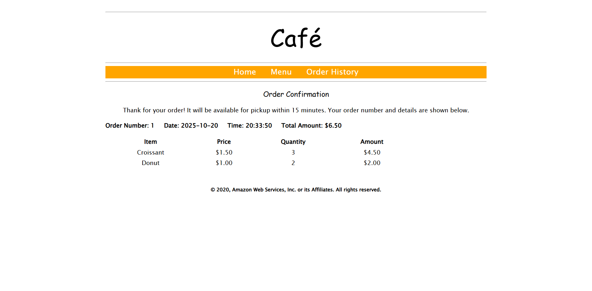

# Lab 15: Optimizing Resource Utilization for the Café Web Application

## 📘 **Overview**

This documentation outlines the optimization of AWS resources used to host the Café web application. The process includes removing the decommissioned local database from the web server to reduce storage usage and resizing the EC2 instance from **t3.small** to **t3.micro** to lower costs. The lab also covers using the **AWS Pricing Calculator** to estimate cost savings before and after optimization.

---

## 🎯 **Goal**

- Optimize the **Café EC2 instance** to reduce AWS costs.
- Use the **AWS Pricing Calculator** to estimate and compare costs before and after optimization.

---

## 🧰 **Tools Used**

- **Amazon EC2**
- **Amazon RDS (MariaDB)**
- **Amazon EBS (gp2)**
- **AWS CLI**
- **AWS Pricing Calculator**

---

## **Architecture**


---

## 🛠️ **Steps Performed**

### **Step 1: Connect to the Café Instance via SSH**

1. Retrieve the **PEM** (macOS/Linux) or **PPK** (Windows) key from the **Details** section.
2. Locate the **Public IP address** of the Café instance.
3. Open an SSH session:
4. Accept the fingerprint prompt by typing `yes`.

---

### **Step 2: Configure the AWS CLI**

1. Identify the region:
    
    ```bash
    curl http://169.254.169.254/latest/dynamic/instance-identity/document | grep region
    
    ```
    
2. Configure AWS CLI:
    
    ```bash
    aws configure
    
    ```
    
    - **AWS Access Key ID:** `<access key>`
    - **AWS Secret Access Key:** `<secret key>`
    - **Default region name:** `<region>`
    - **Default output format:** `json`

---

### **Step 3: Uninstall MariaDB and Resize the EC2 Instance**

1. Stop and uninstall the MariaDB service:
    
    ```bash
    sudo systemctl stop mariadb
    sudo yum -y remove mariadb-server
    
    ```

    

    📌 | Removing the mariadb inside the ec2 would free up storage and processing power allowing the ec2 to be downsize to a smaller instance type. 
    
2. Identify the instance ID:
    
    ```bash
    aws ec2 describe-instances \
    --filters "Name=tag:Name,Values=CafeInstance" \
    --query "Reservations[*].Instances[*].InstanceId"
    
    ```
    
3. Stop the instance:
    
    ```bash
    aws ec2 stop-instances --instance-ids <instance id>
    
    ```
    
4. Modify instance type:
    
    ```bash
    aws ec2 modify-instance-attribute \
    --instance-id <instance id> \
    --instance-type "{\"Value\": \"t3.micro\"}"
    
    ```
    
5. Start the instance:
    
    ```bash
    aws ec2 start-instances --instance-ids <instance id>
    
    ```
    
6. Verify the instance state and connection details:
    
    ```bash
    aws ec2 describe-instances \
    --instance-ids <instance id> \
    --query "Reservations[*].Instances[*].[InstanceType,PublicDnsName,PublicIpAddress,State.Name]"
    
    ```

    

7. Access the Café website:
    
    ```
    http://<public-dns-name>/cafe
    
    ```

    

    Confirm functionality.
    

---

### **Step 4: Estimate AWS Service Costs (Before and After Optimization)**

Use the AWS Price Calculator to calculate the cost of both before the optimization and after.

### **Before Optimization**

- EC2 Instance: **t3.small**
- EBS Volume: **40 GB (gp2)**
- RDS Instance: **db.t3.micro (20 GB gp2)**
- Region: `<region>`
- Pricing Model: **On-Demand**
- Utilization: **100% per month**

| Service | Specification | Monthly Cost (USD) |
| --- | --- | --- |
| Amazon EC2 | t3.small | $20.89 |
| Amazon RDS | db.t3.micro | $14.71 |
| **Total** |  | **$35.60** |


Share the AWS cost estimate to another browser tab


---

### **After Optimization**

- EC2 Instance: **t3.micro**
- EBS Volume: **20 GB (gp2)**
- RDS Instance: **db.t3.micro (20 GB gp2)**
- Region: `<region>`
- Pricing Model: **On-Demand**

| Service | Specification | Monthly Cost (USD) |
| --- | --- | --- |
| Amazon EC2 | t3.micro | $10.47 |
| Amazon RDS | db.t3.micro | $14.71 |
| **Total** |  | **$25.18** |


---

### **Step 5: Estimate Projected Cost Savings**

| Category | Monthly Cost (USD) |
| --- | --- |
| **Before Optimization** | $72.58 |
| **After Optimization** | $64.25 |
| **Projected Monthly Savings** | **$8.33** |

---

## 📝 **Key Takeaways**

- Downsizing EC2 instances directly impacts operational costs.
- Removing unused resources (like decommissioned databases) reduces EBS storage requirements.
- The **AWS Pricing Calculator** helps visualize and compare infrastructure costs effectively.
- Optimization aligns with **cost efficiency** and **resource right-sizing** principles in cloud environments.