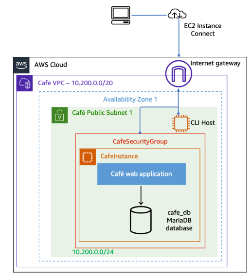
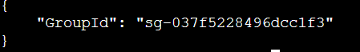
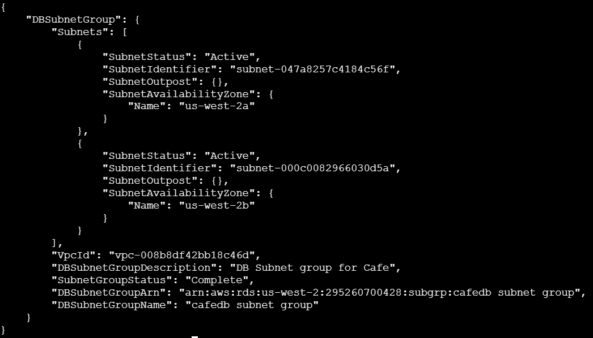

# Lab 07: Migrating the Café App Database to Amazon RDS Overview

## 🎯 **Goal**

In this lab, I migrated the Café web application’s local MySQL database (running on an EC2 LAMP stack) to a fully managed Amazon RDS MariaDB instance.

The objectives were to:

- Generate and migrate sample data from EC2 to RDS.
- Build secure private subnets and database security groups.
- Launch a MariaDB RDS instance using the AWS CLI.
- Restore and verify database integrity.
- Reconfigure the application to connect to the RDS endpoint.
- Monitor the database using CloudWatch metrics.

This migration aligned the app with production-grade standards: **high availability, security, and scalability.**

---

## **Architecture Topology**

### Before Migration

The Café app hosted both its web server and MySQL database on the same EC2 instance — efficient for development but risky for production.



### After Migration

The database was moved to a private RDS MariaDB instance within a multi-AZ subnet group.

The web server now connects securely to RDS through controlled security group access.


---

## **1. Generating Order Data**

Before migrating, I created test data in the café app.

1. Retrieved the Café app URL from the lab details.
2. Accessed the **Menu**, added one of each item, and submitted an order.
3. Verified that the **Order History** tab displayed the entries.

This ensured the old database contained valid data for migration testing.

---

## **2. Setting Up Amazon RDS**

### 2.1 Connecting to the CLI Host

Accessed the CLI Host EC2 instance via **EC2 Instance Connect**, which had the AWS CLI preinstalled.

### 2.2 Configuring AWS CLI

Configured credentials and region parameters:

```bash
aws configure
```

Entered:

- Access Key ID
- Secret Access Key
- Region: `us-west-2`
- Output format: `json`

---

### 2.3 Creating a Security Group for the Database

Created a dedicated database security group:

```bash
aws ec2 create-security-group \
--group-name CafeDatabaseSG \
--description "Security group for Cafe database" \
--vpc-id <CafeInstance VPC ID>
```



> 📌Note: This is the indicator that the SG was created successfully, also take note of this as it will be used later on
> 

Then allowed MySQL traffic only from the app’s EC2 instance security group:

```bash
aws ec2 authorize-security-group-ingress \
--group-id <CafeDatabaseSG Group ID> \
--protocol tcp --port 3306 \
--source-group <CafeSecurityGroup Group ID>
```


> 📌 **Note:** This implements the *principle of least privilege*, ensuring only the app can communicate with the database.
> 

---

### 2.4 Creating Private Subnets

Deployed two private subnets across different Availability Zones for redundancy:

```bash
aws ec2 create-subnet \
--vpc-id <CafeInstance VPC ID> \
--cidr-block 10.200.2.0/23 \
--availability-zone <AZ-1>

aws ec2 create-subnet \
--vpc-id <CafeInstance VPC ID> \
--cidr-block 10.200.10.0/23 \
--availability-zone <AZ-2>
```


> 📌 **Note:** Private subnets keep the database isolated from direct internet access.
> 

---

### 2.5 Creating an RDS Subnet Group

Defined the subnets for the RDS deployment:

```bash
aws rds create-db-subnet-group \
--db-subnet-group-name "CafeDBSubnetGroup" \
--db-subnet-group-description "DB subnet group for Cafe" \
--subnet-ids <Subnet1-ID> <Subnet2-ID> \
--tags "Key=Name,Value=CafeDatabaseSubnetGroup"
```



---

### 2.6 Launching the MariaDB Instance

Created the MariaDB instance within the subnet group:

```bash
aws rds create-db-instance \
--db-instance-identifier CafeDBInstance \
--engine mariadb \
--engine-version 11.4.5 \
--db-instance-class db.t3.micro \
--allocated-storage 20 \
--availability-zone <CafeInstanceAZ> \
--db-subnet-group-name "CafeDBSubnetGroup" \
--vpc-security-group-ids <CafeDatabaseSG Group ID> \
--no-publicly-accessible \
--master-username root \
--master-user-password 'Re:Start!9'

```

Monitored progress:

```bash
aws rds describe-db-instances \
--db-instance-identifier CafeDBInstance \
--query "DBInstances[*].[Endpoint.Address,DBInstanceStatus]"

```

When the status reached **“available”**, I noted the RDS endpoint for later configuration.


---

## **3. Migrating Data to RDS**

### 3.1 Backing Up the Existing Database

On the EC2 LAMP instance:

```bash
mysqldump --user=root --password='Re:Start!9' \
--databases cafe_db --add-drop-database > cafedb-backup.sql

```

This exported all schema and data into a single SQL file.

---

### 3.2 Restoring the Backup to RDS

Restored the backup using the RDS endpoint:

```bash
mysql --user=root --password='Re:Start!9' \
--host=<RDS Endpoint> \
< cafedb-backup.sql

```

Once completed, the RDS instance contained the same data as the EC2-hosted database.

---

### 3.3 Verifying Data Integrity

Connected directly to RDS to confirm successful import:

```bash
mysql --user=root --password='Re:Start!9' \
--host=<RDS Endpoint> \
cafe_db

```


Queried the table:

```sql
SELECT * FROM product;

```


All product entries were present, confirming migration success.

---

## **4. Reconfiguring the Application**

The café app used **AWS Systems Manager Parameter Store** to store its configuration.

1. Navigated to **Systems Manager → Parameter Store**.
2. Located the parameter `/cafe/dbUrl`.
3. Updated the value with the new RDS endpoint.
4. Saved the change.

After reloading the app, all previous and new orders successfully stored data in the RDS database.

---

## **5. Monitoring the RDS Instance**

Used **Amazon CloudWatch** to observe performance metrics via the RDS Monitoring tab.

Metrics analyzed included:

- CPU Utilization
- Database Connections
- Free Storage Space
- Freeable Memory
- Read/Write IOPS

To validate metrics in real time, established a connection:


```bash
mysql --user=root --password='Re:Start!9' \
--host=<RDS Endpoint> \
cafe_db

```

The **DatabaseConnections** metric reflected the live session and dropped back to zero after exiting.

Checked **DatabaseConnections** metric — it spiked to `1`.After `exit`, the metric dropped back to `0`.


> 📌 **Note:** Setting the refresh rate to 10 seconds in the CloudWatch console provides near real-time metric updates.
> 

---

## **Key Takeaways**

✅ **Separation of Concerns** — Moving the database to RDS improves reliability and scalability.

✅ **Security by Design** — Implementing private subnets and controlled SG access follows best practices.

✅ **CLI Automation** — AWS CLI scripting allows repeatable, error-free provisioning.

✅ **Visibility and Monitoring** — CloudWatch integration provides insight into database performance.

✅ **Simplified Configuration** — Parameter Store enables fast, centralized app configuration management.