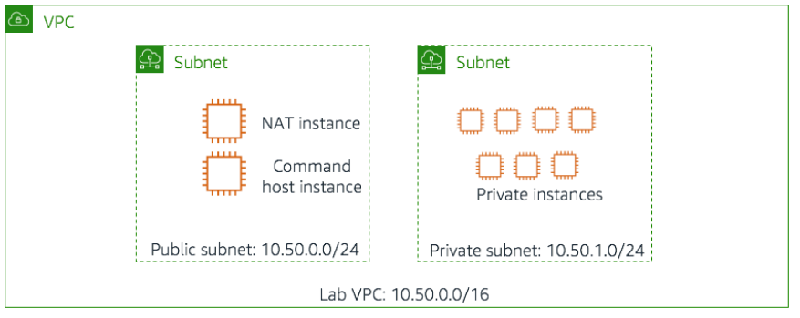
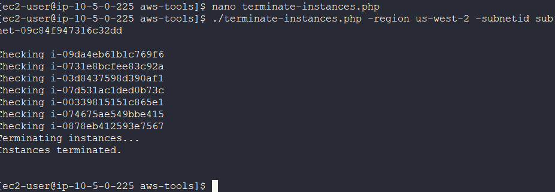
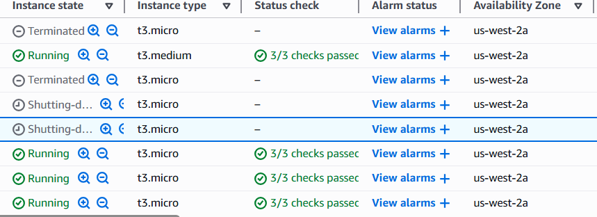

# Lab 12 - Managing Resources with Tagging

## 📘 Overview

This lab demonstrates how to manage AWS resources using **tags** to organize, automate, and control instances. It’s divided into two sections:

1. Using the AWS CLI to inspect, modify, and act upon EC2 instances based on their tags.
2. A challenge to identify and terminate non-compliant instances lacking required tags.

---

## 🎯 Goal

- Apply and modify tags on existing AWS resources.
- Query resources based on tags using the AWS CLI.
- Stop, start, and terminate EC2 instances based on tag compliance.

---

## 🧰 Tools Used

- Amazon EC2
- AWS Command Line Interface (CLI)
- AWS SDK for PHP
- SSH (PuTTY or terminal)

---

## Architecture



---

## 🛠️ Steps Performed

### Step 1: Connect to the Command Host

**Windows:**

1. In the lab’s *Details* panel, click **Download PPK** and note the **Public IP**.
2. Open **PuTTY**, configure SSH with the `.ppk` key, and connect to:

---

### Step 2: Find Development Instances by Tag

Run the following commands to explore tag-based filtering:

List all instances with the Project tag `ERPSystem`:

```bash
aws ec2 describe-instances --filter "Name=tag:Project,Values=ERPSystem"

```

Return only instance IDs:

```bash
aws ec2 describe-instances --filter "Name=tag:Project,Values=ERPSystem" --query 'Reservations[*].Instances[*].InstanceId'

```


Include both instance ID and Availability Zone:

```bash
aws ec2 describe-instances --filter "Name=tag:Project,Values=ERPSystem" --query 'Reservations[*].Instances[*].{ID:InstanceId,AZ:Placement.AvailabilityZone}'

```

Include Project, Environment, and Version tags:

```bash
aws ec2 describe-instances \
--filter "Name=tag:Project,Values=ERPSystem" \
--query 'Reservations[*].Instances[*].{ID:InstanceId,AZ:Placement.AvailabilityZone,Project:Tags[?Key==`Project`] | [0].Value,Environment:Tags[?Key==`Environment`] | [0].Value,Version:Tags[?Key==`Version`] | [0].Value}'

```

Filter only *development* instances within *ERPSystem*:

```bash
aws ec2 describe-instances \
--filter "Name=tag:Project,Values=ERPSystem" "Name=tag:Environment,Values=development" \
--query 'Reservations[*].Instances[*].{ID:InstanceId,AZ:Placement.AvailabilityZone,Project:Tags[?Key==`Project`] | [0].Value,Environment:Tags[?Key==`Environment`] | [0].Value,Version:Tags[?Key==`Version`] | [0].Value}'

```

📌 | JMESPath syntax is used to query and format JSON output directly from CLI results.

---

### Step 3: Change Version Tag for Development Instances

Open the script for editing:

```bash
nano change-resource-tags.sh

```

Script contents:

```bash
#!/bin/bash
ids=$(aws ec2 describe-instances --filter "Name=tag:Project,Values=ERPSystem" "Name=tag:Environment,Values=development" --query 'Reservations[*].Instances[*].InstanceId' --output text)
aws ec2 create-tags --resources $ids --tags 'Key=Version,Value=1.1'

```

Run the script:

```bash
./change-resource-tags.sh

```

Verify updated Version tags:

```bash
aws ec2 describe-instances --filter "Name=tag:Project,Values=ERPSystem" --query 'Reservations[*].Instances[*].{ID:InstanceId, AZ:Placement.AvailabilityZone, Project:Tags[?Key==`Project`] |[0].Value,Environment:Tags[?Key==`Environment`] | [0].Value,Version:Tags[?Key==`Version`] | [0].Value}'

```

📌 | The script overwrites the `Version` tag for all ERPSystem *development* instances from 1.0 to 1.1.

---

### Step 4: Stop and Start Instances by Tag

Navigate to the AWS tools directory:

```bash
cd aws-tools

```

Open the **stopinator.php** script:

```bash
nano stopinator.php
```

This PHP script uses the AWS SDK to **stop or start instances** based on tags.

Run it to stop all *ERPSystem* development instances:

```bash
./stopinator.php -t"Project=ERPSystem;Environment=development"

```


Then restart them:

```bash
./stopinator.php -t"Project=ERPSystem;Environment=development" -s
```

📌 |Note:  The `-s` flag switches behavior from stopping to starting tagged instances.

---

### Step 5: Challenge – Terminate Non-Compliant Instances

Goal: **Terminate instances in the private subnet that lack the `Environment` tag.**

📌 | The exercise enforces a “tag-or-terminate” compliance policy.

Open and review the termination script:

```bash
nano terminate-instances.php
```

Key logic sections:

1. **Identify compliant instances:** those with the `Environment` tag.
2. **Compare lists:** find instances in the subnet without the tag.
3. **Terminate:** call the `terminateInstances()` method on the non-compliant IDs.

---

### Step 6: Prepare Environment for Script Testing

1. In the EC2 console, select a few instances in the private subnet.
2. Remove the **Environment** tag from two of them.
3. Copy the **Region** (without the final letter) and **Subnet ID** values.

Run the script, replacing placeholders:

```bash
./terminate-instances.php -region <region> -subnetid <subnet-id>

```

Expected output example:

```
Checking i-xxxxxxx
Checking i-yyyyyyy
Terminating instances...
Instances terminated.

```





📌 | The script terminates all EC2 instances in the specified subnet that lack the Environment tag.

---

## 📝 Key Takeaways

- Tags enable structured resource management and automation.
- JMESPath enhances AWS CLI queries for custom data output.
- Scripts can use tag-based logic for environment control (e.g., stop/start/terminate).
- Enforcing tag compliance through automation improves security and governance.
- AWS CLI and SDKs together allow scalable, policy-driven infrastructure management.