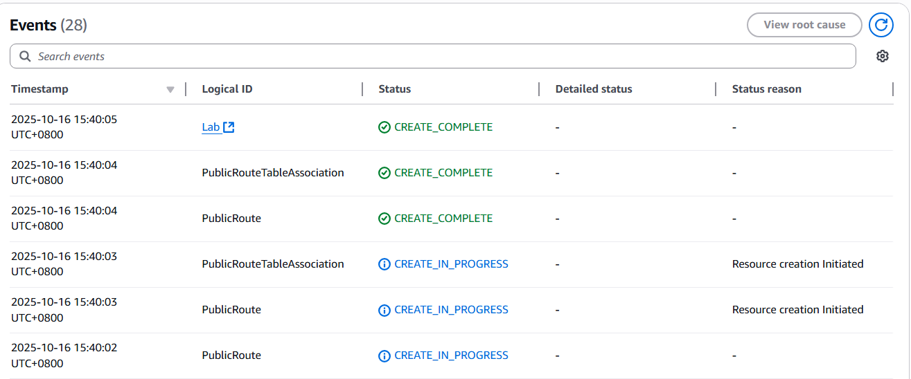
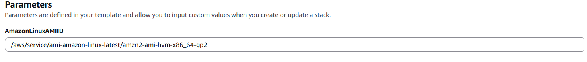

# Lab 12: Automation with CloudFormation

## 📘 Overview

This lab explores **automating infrastructure deployment using AWS CloudFormation**. Instead of manually provisioning resources, CloudFormation uses templates to deploy infrastructure consistently and reliably — even during off-hours.

The lab involves deploying, updating, and deleting CloudFormation stacks to manage a VPC, Security Group, S3 bucket, and EC2 instance.

---

## 🎯 Goal

- Deploy a CloudFormation stack that creates a **VPC** and **Security Group**
- Add an **Amazon S3 bucket** to the existing stack
- Extend the stack to include an **Amazon EC2 instance**
- Delete the stack and verify cleanup of all resources

---

## 🧰 Tools Used

- AWS Management Console
- AWS CloudFormation
- Amazon S3
- Amazon EC2
- AWS Systems Manager Parameter Store
- YAML

---

## Architecture


---

## 🛠️ Steps Performed

### Step 1: Access the AWS Management Console

1. Click **Start Lab** to initialize the environment.
2. Wait until the message shows **Lab status: ready**.
3. Click the **AWS** button at the top of the instructions.
4. A new tab will open automatically, logging in to the AWS Management Console.
5. If the tab does not open, allow pop-ups in your browser.

📌 | Suggestion: Keep the AWS Console and the lab instructions visible side by side for convenience.

📌 | Note: Do not change the AWS Region during the session.

---

### Step 2: Deploy the Initial CloudFormation Stack

1. Download the template file: **task1.yaml**.
2. Open the file in a text editor.
3. Review key template sections:
    - **Parameters**: defines CIDR ranges for the VPC and Subnet.
    - **Resources**: defines the VPC and Security Group.
    - **Outputs**: provides information such as the default Security Group ID.
4. In the AWS Console, navigate to **CloudFormation** → **Create stack**.
5. Choose **Upload a template file**, then upload **task1.yaml**.
6. Configure:
    - **Stack name:** `Lab`
    - Leave parameter defaults as they are.
7. Proceed through **Next**, leaving all other options as default.
8. Acknowledge custom resource names when prompted.
9. Click **Create stack**.
10. Wait for status to reach **CREATE_COMPLETE**.



📌 | The Events tab logs the creation process in reverse chronological order.


📌 | The Resources tab shows each created resource and its dependency order.

Optional: Open the **VPC Console** to verify the created VPC, then return to **CloudFormation**.

---

### Step 3: Add an Amazon S3 Bucket to the Stack

1. Edit **task1.yaml** and add an S3 bucket under the **Resources:** section.
2. Follow AWS CloudFormation S3 Template Snippets.
3. Example addition (minimal):
    
    ```yaml
    MyS3Bucket:
      Type: AWS::S3::Bucket
    
    ```
    
4. Save the file.
5. In the **CloudFormation console**, select the **Lab** stack → **Update**.
6. Choose **Replace current template** and upload the modified file.

    
    
7. Proceed through the pages using **Next**, leaving options default.
8. Review the **Change Set Preview**, which should show **Add AWS::S3::Bucket**.
9. Click **Update stack**.

    
    
    📌 | CloudFormation automatically assigns a unique bucket name to avoid naming conflicts.
    
10. Wait for the status to change from **UPDATE_IN_PROGRESS** to **UPDATE_COMPLETE**.

📌 | Indentation in YAML must use two spaces per level — incorrect spacing can cause deployment failure.

Optional: Check the **S3 console** to verify bucket creation.

---

### Step 4: Add an Amazon EC2 Instance to the Stack

1. In **task1.yaml**, add a parameter for the latest Amazon Linux 2 AMI:
    
    ```yaml
    AmazonLinuxAMIID:
      Type: AWS::SSM::Parameter::Value<AWS::EC2::Image::Id>
      Default: /aws/service/ami-amazon-linux-latest/amzn2-ami-hvm-x86_64-gp2

    ```

    
    
    📌 | You will notice that it has been added in the parameters on AWS’s cloudformation’s Config console
    
2. Under the **Resources** section, add the EC2 instance definition:
    
    ```yaml
    EC2Instance:
      Type: AWS::EC2::Instance
      Properties:
        ImageId: !Ref AmazonLinuxAMIID
        InstanceType: t3.micro
        SecurityGroupIds:
          - !Ref AppSecurityGroup
        SubnetId: !Ref PublicSubnet
        Tags:
          - Key: Name
            Value: App Server
    
    ```
    
3. Save and upload the updated template through the **Update Stack** option.
4. Review the **Change Set Preview**, confirming that an EC2 instance will be added.
5. Click **Update stack** and wait until the status reaches **UPDATE_COMPLETE**.

    
    
    📌 | The EC2 instance references existing VPC components defined earlier in the template.
    

📌 | The `!Ref` function retrieves resource IDs from within the same template.

Optional: Visit the **EC2 console** to confirm that the **App Server** instance is running.

---

### Step 5: Delete the CloudFormation Stack

1. In **CloudFormation**, select the `Lab` stack.
2. Click **Delete**, then confirm.
3. The stack will enter **DELETE_IN_PROGRESS** status.
4. Wait until it disappears from the stack list.

📌 | CloudFormation automatically deletes all resources it created, including the VPC, S3 bucket, and EC2 instance.

📌 | If any resource remains, verify if it has dependencies preventing deletion (e.g., non-empty S3 bucket).

Optional: Validate in **S3**, **EC2**, and **VPC** consoles that all resources have been removed.

---

## 📝 Key Takeaways

- CloudFormation enables **consistent, automated** infrastructure deployment.
- Templates define **parameters, resources, and outputs**, controlling every resource in the stack.
- **Stack updates** allow you to modify infrastructure incrementally without redeploying everything.
- **Deletion** of stacks ensures complete cleanup, reducing resource sprawl.
- YAML syntax and indentation are critical for valid template execution.
- Using **AWS Systems Manager Parameter Store** makes templates region-agnostic and easier to maintain.