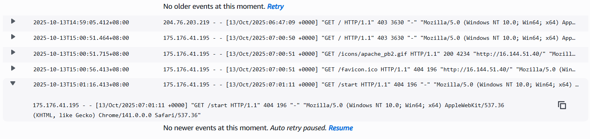
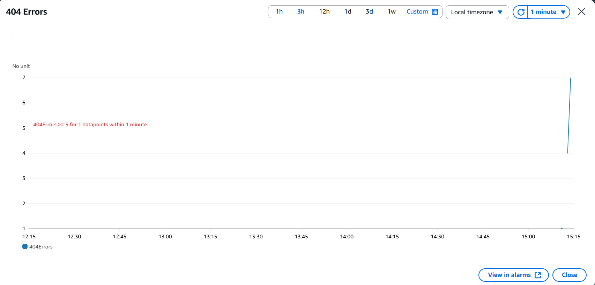
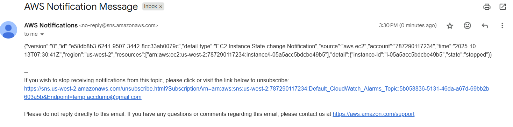

# Lab 08: Monitoring Infrastructure

## 📘 **Overview**

In this lab, I explored how to monitor my AWS infrastructure and applications using **Amazon CloudWatch** and **AWS Config**. The focus was on setting up monitoring, log collection, real-time alerts, and compliance tracking to ensure reliability and visibility across deployed resources.

## 🎯 **Goal**

- Use **AWS Systems Manager Run Command** to install and configure the **CloudWatch Agent** on EC2.
- Collect and monitor **system metrics** and **application logs**.
- Create **metric filters** and **alarms** for log-based alerts.
- Configure **real-time notifications** through **CloudWatch Events** and **SNS**.
- Track **resource compliance** using **AWS Config** rules.

## **Architecture**

Before configuration, I had a single **Web Server EC2 instance** running a web application.

After completing the lab:


- The instance was reporting logs and metrics to **Amazon CloudWatch**.
- Alerts and notifications were sent via **Amazon SNS**.
- **AWS Config** continuously evaluated infrastructure compliance.

---

## 🛠️ **Steps Performed**

### **Task 1: Installing the CloudWatch Agent**

I started by opening **AWS Systems Manager** and using **Run Command** to install the **CloudWatch agent** on my EC2 instance named *Web Server*.

1. In **Systems Manager**, I went to **Run Command → Run a Command**.
2. Selected **AWS-ConfigureAWSPackage**.
3. Set the following parameters:
    - **Action:** Install
    - **Name:** AmazonCloudWatchAgent
    - **Version:** latest
4. In **Targets**, I manually selected the **Web Server** instance.
5. Chose **Run** and waited for the **Overall status** to show *Success*.

📌 | The lab requires me to confirm installation by checking the **Output** tab — seeing “Successfully installed arn:aws:ssm:::package/AmazonCloudWatchAgent” confirms the agent is installed.

Next, I stored the CloudWatch agent configuration in **Parameter Store**.

**Parameter name:** `Monitor-Web-Server`

**Description:** Collect web logs and system metrics

📌 | The lab requires me to create this configuration JSON to define which logs and metrics to collect.

It included:

- **Logs:** `/var/log/httpd/access_log` and `/var/log/httpd/error_log`
- **Metrics:** CPU, disk, memory, and swap usage

After creating the parameter, I used another **Run Command**:

- Selected **AmazonCloudWatch-ManageAgent**
- **Action:** configure
- **Mode:** ec2
- **Optional Configuration Source:** ssm
- **Optional Configuration Location:** Monitor-Web-Server
- **Optional Restart:** yes
- Targeted the **Web Server instance**

When this command succeeded, the CloudWatch agent began sending log and metric data to CloudWatch.

---

### **Task 2: Monitoring Application Logs Using CloudWatch Logs**

To verify logs were being sent, I accessed the web server using its **public IP** and opened the test page.

To generate log activity, I browsed to a non-existent path like `/start`. This created 404 errors in the **access logs**, which were sent to **CloudWatch Logs**.



📌 | The lab requires me to open the log stream to verify that entries (like GET requests and 404s) are visible.

---

### **Creating a Metric Filter for 404 Errors**

To monitor 404 errors:

1. Selected the `HttpAccessLog` log group.
2. From **Actions**, chose **Create metric filter**.
3. Used this pattern:
    
    ```
    [ip, id, user, timestamp, request, status_code=404, size]
    
    ```
    
4. Named the filter **404Errors**, and set:
    - **Metric namespace:** LogMetrics
    - **Metric name:** 404Errors
    - **Metric value:** 1

Then I created the filter and moved on to creating an alarm.

---

### **Creating a CloudWatch Alarm**

1. In the **404Errors** panel, chose **Create alarm**.
2. Configured:
    - **Period:** 1 minute
    - **Condition:** Greater/Equal to 5
3. Created a new **SNS topic** with my email.
4. Named the alarm **404 Errors**.

📌 | The lab requires me to confirm the email subscription from SNS before proceeding.

To trigger the alarm, I accessed the web server several times using fake paths (like `/start2`, `/fakepage`, etc.).

After a few minutes, the alarm turned red (ALARM state) and I received an email notification with subject:



**ALARM: "404 Errors"**


---

### **Task 3: Monitoring Instance Metrics Using CloudWatch**

Next, I switched to **EC2 → Instances → Web Server → Monitoring tab** to view the system metrics.

I explored **CloudWatch → Metrics → CWAgent**, where I found metrics for:

- **CPU usage**
- **Memory**
- **Disk space**
- **Disk I/O**

📌 | The lab requires me to view both CloudWatch native metrics and CloudWatch Agent metrics — the agent provides deeper system insight (like memory and disk details).

---

### **Task 4: Creating Real-Time Notifications**

I set up a **CloudWatch Event rule** to notify me when the instance is stopped or terminated.

1. In **CloudWatch → Events → Rules → Create rule**, entered:
    - **Name:** Instance_Stopped_Terminated
2. Defined pattern:
    - **Service:** EC2
    - **Event Type:** EC2 Instance State-change Notification
    - **Specific states:** stopped, terminated
3. For target:
    - **AWS Service:** SNS Topic
    - **Topic:** Default_CloudWatch_Alarms_Topic

After creating the rule, I stopped the instance from **EC2 → Instance state → Stop instance**.



📌 | The lab requires me to check my email — a JSON-formatted message from CloudWatch confirms the rule is working.

---

### **Task 5: Monitoring Infrastructure Compliance**

Finally, I opened **AWS Config** to ensure tagging and EBS volume compliance.

1. If prompted, I selected **Get started → Next → Confirm** to initialize AWS Config.
2. Added two rules:
    - **required-tags** → required tag: `project`
    - **ec2-volume-inuse-check** → checks for unattached EBS volumes
    
    
    

📌 | The lab requires me to wait for the evaluations to complete before viewing compliant vs non-compliant resources.

Once complete:

- `required-tags`: EC2 instance compliant; others non-compliant
- `ec2-volume-inuse-check`: one attached (compliant), one unattached (non-compliant)

---

📝 **Key Takeaways**

- **CloudWatch Agent** extends monitoring beyond default metrics, including OS-level data.
- **CloudWatch Logs** enables real-time log monitoring and alerting without logging into instances.
- **CloudWatch Events** automates notifications for infrastructure changes.
- **AWS Config** provides compliance visibility and enforces resource standards.
- Together, these services form a unified monitoring and governance ecosystem.