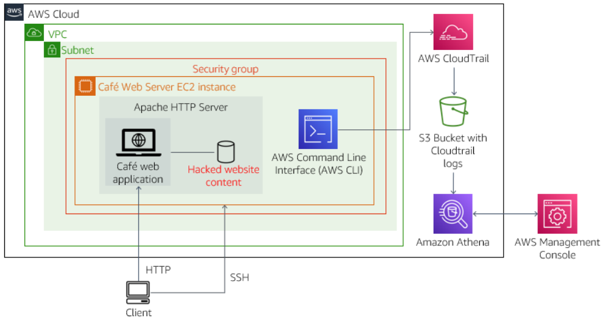
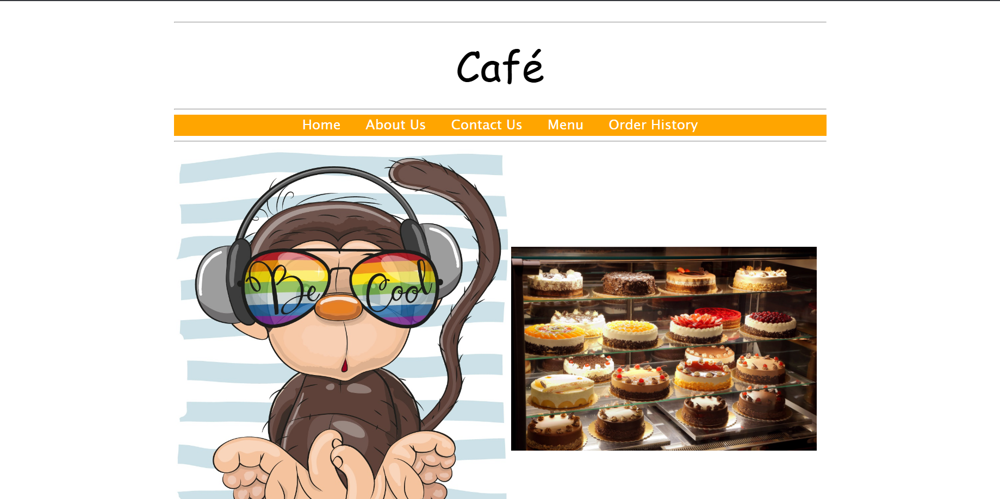
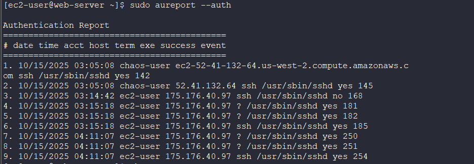

# Lab 10: AWS CloudTrail – Investigating the Café Website Hack

## 📘 **Overview**

This lab demonstrates how to use AWS CloudTrail to audit user activity and investigate a simulated security breach on an EC2-hosted Café website. The process includes trail configuration, log analysis using the AWS CLI and Linux utilities, event exploration in Athena, and identification of the user who modified the EC2 security group. It also covers securing the instance and restoring normal operations.

## 🎯 **Goal**

- Configure and verify a CloudTrail trail
- Analyze CloudTrail logs using Linux commands and AWS CLI
- Explore CloudTrail data through Athena
- Identify the user responsible for unauthorized EC2 security group modifications
- Secure the AWS account and EC2 instance

## 🧰 **Tools Used**

- AWS CloudTrail
- AWS CLI
- Amazon S3
- Amazon Athena
- Amazon EC2
- Linux Command Line Utilities

---

## **Architecture**



---

## 🛠️ **Steps Performed**

### **Step 1: Initial Setup and Website Verification**

- Verify that the Café Web Server instance and its security group allow only HTTP traffic.
- Access the website using the public IP:
    
    ```
    http://<WebServerIP>/cafe/
    
    ```
    
    The page should load normally with no modifications.
    

📌 | The lab requires me to confirm that the web server is accessible and visually intact before enabling CloudTrail.

---

### **Step 2: Create the CloudTrail Trail**

- Create a CloudTrail trail named `monitor`.
- Configure the trail to log **all management events** and store logs in a new S3 bucket named `monitoring####`.
- Avoid using hyphens in the S3 bucket name (e.g., `monitor-v1`), as AWS may reformat it to `monitor_v1`, which Athena does not accept.
- Verify the trail creation in the CloudTrail console.
    
    
    

📌 | The lab requires me to use the name “monitor” trail, which might trigger the hacking simulation.

---

### **Step 3: Detect the Hack**

- Wait a few minutes after enabling the trail, then refresh the Café website.
    
    *(Hold Shift to force a cache refresh if no change appears.)*
    
    
    
- Observe that the homepage has been replaced with an unauthorized image.
- Check the EC2 security group configuration and confirm that a new inbound rule for **SSH (port 22)** open to **0.0.0.0/0** has been added.
    
    
    

📌 | Always check the EC2 security group first when investigating unauthorized access.

---

### **Step 4: Analyze Logs via SSH**

- Connect to the EC2 instance using SSH and the PEM key.
- Create a directory for log analysis and download CloudTrail logs from the S3 bucket:
    
    ```bash
    aws s3 cp s3://monitoring####/ . --recursive
    
    ```
    
- Extract all `.gz` log files:
    
    ```bash
    gunzip *.gz
    
    ```
    
- Use `grep` to search for event names and source IPs:
    
    ```bash
    for i in $(ls); do echo $i && cat $i | python -m json.tool | grep eventName ; done
    
    ```
    
- Identify log entries related to security group modifications.

📌 | The lab requires me to manually review JSON log files to understand structure and event metadata.

---

### **Step 5: Query CloudTrail Using the AWS CLI**

- Use the AWS CLI to search for EC2 security group–related activity:
    
    ```bash
    aws cloudtrail lookup-events \
    --lookup-attributes AttributeKey=ResourceType,AttributeValue=AWS::EC2::SecurityGroup
    
    ```
    
- Narrow the query by specifying the exact security group ID associated with the Café Web Server.
- Determine that a user named **chaos-user** modified the security group to allow SSH from all IP addresses.

📌 | The lab requires me to filter CloudTrail events using both resource type and the target security group ID.

---

### **Step 6: Investigate Using Athena**

- Create an Athena table from the CloudTrail logs using the CloudTrail console.
- Run SQL queries to identify user activity:
    
    ```sql
    SELECT useridentity.userName, eventtime, eventsource, eventname, requestparameters
    FROM cloudtrail_logs_monitoring####
    LIMIT 30;
    
    ```
    
- Note that Athena only displays **login** activity and not the **write** or **update** actions.
- Conclude that raw CloudTrail logs provide more complete visibility than Athena’s summarized dataset.
    
    
    

📌 | Multiple Athena queries can be executed by selecting “Add query” within the console.

---

### **Step 7: Remove the Unauthorized User and Secure the Instance**

- On the EC2 instance, check for active logins:
    
    ```bash
    sudo aureport --auth
    who
    ```
    
    
    
    📌 | Identify an unauthorized OS-level user named chaos-user but as the user is still logged in the process needs to be killed first
    
- Terminate the user’s process:
    
    ```bash
    sudo kill -9 <process_number>
    ```
    
    
    
- Edit the SSH configuration file `/etc/ssh/sshd_config` to disable password authentication.
- Restart the SSH service and remove the public SSH rule from the EC2 security group.

📌 | The lab requires me to confirm that no unauthorized user sessions remain active before proceeding with cleanup.

---

### **Step 8: Restore Website Functionality and Clean Up**

- Restore the original website image:
    
    ```bash
    sudo mv Coffee-and-Pastries.backup Coffee-and-Pastries.jpg
    
    ```
    
- Verify that the Café website displays normally.
    
    
    
- Delete the **chaos** IAM user from the AWS Management Console.

---

## 📝 **Key Takeaways**

- AWS CloudTrail provides a complete record of account activity and supports deep security investigations.
- Athena’s pre-aggregated dataset is useful for exploration but omits detailed write events.
- Restricting SSH access and disabling password authentication improve EC2 instance security.
- Consistent log monitoring and IAM hygiene reduce breach risks.
- A single misconfigured inbound rule (e.g., `0.0.0.0/0`) can expose the entire infrastructure.