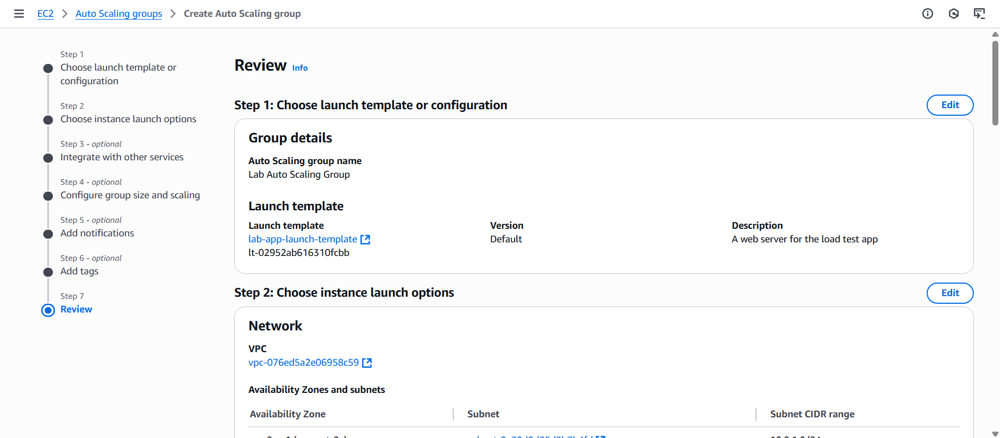

# Lab 03: Scaling and Load Balancing Your Architecture

## 📘 **Overview**

This lab demonstrates how to scale an existing web architecture by introducing **Application Load Balancer (ALB)** and **Amazon EC2 Auto Scaling**. The setup evolves from a single-instance deployment within one subnet to a **multi-AZ, highly available environment**.

The configuration ensures that if one instance or Availability Zone becomes unavailable, traffic automatically redirects to healthy targets, maintaining uptime and stability.

---

## 🎯 **Goal**

Enhance the web application’s availability and scalability by integrating **Elastic Load Balancing (ELB)** and **Auto Scaling**. The objective is to distribute traffic evenly across multiple EC2 instances and automatically adjust capacity based on demand, transforming a single-instance setup into a fault-tolerant and self-healing architecture.

---

## 🧰 **Tools Used**

- **Amazon EC2**
- **Amazon Machine Image (AMI)**
- **Elastic Load Balancer (ALB)**
- **Auto Scaling Group (ASG)**
- **CloudWatch Alarms**
- **VPC with public and private subnets**

---

## **Architecture**

### **Before**

A single EC2 web server hosted the application within one public subnet.

### **After**

Traffic is now routed through an **Application Load Balancer** that distributes requests across multiple EC2 instances managed by **Auto Scaling** across different Availability Zones.

---

## 🛠️ **Steps Performed**

### **Step 1: Create an Amazon Machine Image (AMI)**

Select the existing **Web Server 1** instance and create an **AMI** named `Web Server AMI`.

This AMI will serve as the standardized image for all future instances launched by the Auto Scaling Group.

📌 | The AMI acts as a snapshot that ensures consistency across all automatically launched instances.

---

### **Step 2: Configure the Application Load Balancer (ALB)**

Create an **Application Load Balancer** named `LabELB` and configure it across **two public subnets** in separate Availability Zones.

Attach the **Web Security Group** to permit inbound HTTP traffic on port 80.

Then:

- Create a **Target Group** named `lab-target-group` (Target type: *Instances*).
    
    
    
- Register the initial EC2 instances as targets.
- Configure a health check path (e.g., `/index.html`).

📌 | The ALB ensures even traffic distribution and continuous monitoring of instance health.

---

### **Step 3: Build the Launch Template**

Create a **Launch Template** named `lab-app-launch-template` with the following parameters:

- AMI: `Web Server AMI`
- Instance Type: `t3.micro`
- Security Group: `Web Security Group`
- User Data: (optional startup script, if applicable)

📌 | Launch templates standardize instance creation and make scaling predictable.

---

### **Step 4: Create the Auto Scaling Group (ASG)**

Set up the **Auto Scaling Group** using the previously created launch template.

Assign it to **two private subnets** (`<private subnet A>` and `<private subnet B>`).

Associate it with the **Target Group (`lab-target-group`)** connected to the ALB.

Configure scaling parameters:

- Desired Capacity: **2**
- Minimum Size: **2**
- Maximum Size: **4**
- Policy: **Target Tracking (Average CPU Utilization = 50%)**

📌 | The ASG automatically scales in and out based on CPU utilization thresholds.

---

### **Step 5: Verify Load Balancing**

After the ASG launches the initial EC2 instances, verify their **health status** in the Target Group.

Access the **Load Balancer DNS name** to confirm requests are distributed between instances.

📌 | Healthy targets indicate that the ALB and ASG integration is working correctly.

---

### **Step 6: Test Auto Scaling Behavior**

Use a CPU stress script to simulate heavy load. When the **average CPU utilization exceeds 50%**, **CloudWatch Alarms** trigger a **scale-out event**, launching new instances automatically.

Once the simulated load is removed, a **scale-in event** occurs, terminating excess instances.

> 📌 Note: Notice in the Left the Lab Instance has 3 Instances? This showed that the Alarm was successful in scaling the server after it reaches over specified limit

---

### **Step 7: Cleanup**

After testing, terminate the original **Web Server 1** instance, as the Auto Scaling Group now maintains the required capacity using the AMI template.

📌 | Cleanup prevents unnecessary charges and ensures only scalable components remain active.

---

## 📝 **Key Takeaways**

- **Elastic Load Balancing** distributes traffic and enhances fault tolerance across multiple Availability Zones.
- **Auto Scaling** dynamically adjusts resources based on workload demands, improving cost efficiency.
- **CloudWatch Alarms** enable automated scaling through monitoring metrics.
- Hosting EC2 instances in **private subnets** with an ALB in public subnets is a **security best practice**.
- Using **AMIs and launch templates** ensures all new instances remain consistent and compliant with configuration standards.

---

## Troubleshooting Knowledge Base

| Issue Number | Categories | Issue Description | Symptoms | Root Cause Analysis | Resolution Procedures | Helpful Tools or Resources | Comments |
| --- | --- | --- | --- | --- | --- | --- | --- |
| 1 | Monitoring | No Cloudwatch alarm was automatically created by Auto Scaling Group | CloudWatch alarms (scale-in and scale-out) that should have been auto-created by the Auto Scaling group are not visible in the console | User probably made the Auto Scaling group **without adding a scaling policy or permissions/configuration error**, so alarms never got generated | Re-add a **target tracking scaling policy** to your Auto Scaling group. That will auto-create the CloudWatch alarms. | AWS Console | Check for a pop-up about a policy error |
