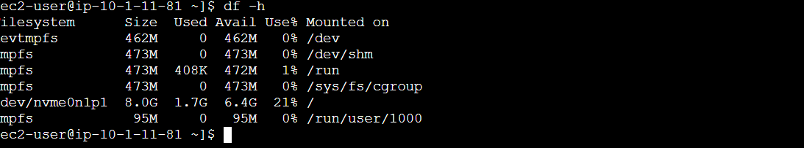
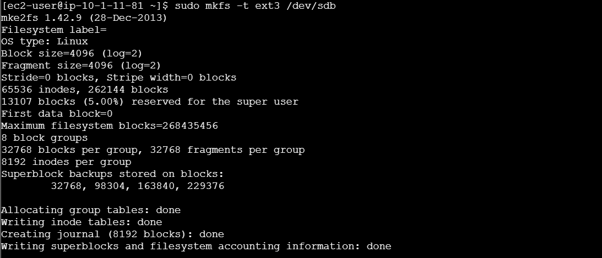
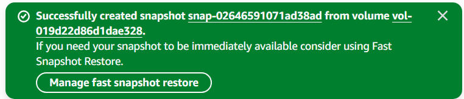

# Lab 06: Working with Amazon EBS — Scalable Storage on the Cloud

## **Goal**

When I started this lab, my goal was to get hands-on with **Amazon Elastic Block Store (EBS)** — AWS’s block-level storage service for EC2 instances.

**Objective:** Create a new volume, attach it to an EC2 instance, mount it, back it up with a snapshot, and restore it.

This lab felt like managing the hard drive of a cloud computer — only smarter and more flexible.

---

## Architecture Topology


---

## Setting the Stage

1. Launched the **AWS Management Console** and confirmed that the **Lab EC2 instance** was running.
2. Noted the **Availability Zone (AZ)** of the instance (e.g., `us-west-2a`).
    
    
    
    > Note: EBS volumes must be in the same AZ as the EC2 instance they will attach to.
    > 
3. Navigated to **Elastic Block Store → Volumes** and created a new volume with the following configuration:
    - **Type:** General Purpose SSD (gp2)
    - **Size:** 1 GiB
    - **AZ:** same as EC2 instance **this is very important!**
        
        
        
    - **Tag:** Name = My Volume
4. Waited until the status changed from `Creating` to `Available`.

---

## Task 1: Attaching the Volume

1. Selected **My Volume** from the EBS console.
2. From the **Actions** menu, chose **Attach Volume**.
3. Selected the **Lab instance** and used the device name `/dev/sdb`.
4. Confirmed attachment.
    
    > Note: Once the volume status changed to In-use, the new block storage was successfully attached to the EC2 instance.
    > 

---

## Task 2: Connecting to the Instance

1. Used **EC2 Instance Connect** to open a terminal session.
2. Verified existing storage using:
    
    ```bash
    df -h
    ```
    
    
    
    > Note: The output only displayed the root volume; the new /dev/sdb volume was not yet mounted.
    > 

---

## Task 3: Creating and Mounting a File System

1. Formatted the attached volume with an ext3 file system:
    
    ```bash
    sudo mkfs -t ext3 /dev/sdb
    ```
    
    
    
2. Created a directory to serve as a mount point:
    
    ```bash
    sudo mkdir /mnt/data-store
    ```
    
3. Mounted the volume:
    
    ```bash
    sudo mount /dev/sdb /mnt/data-store
    ```
    
4. Added the mount configuration to `/etc/fstab` for persistence across reboots:
    
    ```bash
    echo "/dev/sdb   /mnt/data-store ext3 defaults,noatime 1 2" | sudo tee -a /etc/fstab
    ```
    
    
    
5. Verified the mounted volume:
    
    ```bash
    df -h
    ```
    
    
    
    > Note: The new mount point /mnt/data-store appeared in the output, confirming the volume was successfully mounted.
    > 

---

## Task 4: Writing Data

1. Created a test file on the new volume:
    
    ```bash
    sudo sh -c "echo 'some text has been written' > /mnt/data-store/file.txt"
    ```
    
2. Verified that the file was written:
    
    ```bash
    cat /mnt/data-store/file.txt
    ```
    
    
    
    > Note: Seeing the text confirmed that the volume was writable and fully operational.
    > 

---

## Task 5: Creating a Snapshot

1. In the **Volumes** section, selected **My Volume**.
2. From the **Actions** menu, chose **Create Snapshot**.
3. Named it **My Snapshot**.
    
    
    
    > Note: EBS snapshots are incremental and stored in Amazon S3. They can be used for backup, cloning, or restoration.
    > 
4. While the snapshot was in *Pending* status, deleted the test file to simulate data loss:
    
    ```bash
    sudo rm /mnt/data-store/file.txt
    ls /mnt/data-store/file.txt
    ```
    
    
    
    > Note: The error message confirmed the file was deleted — setting the stage for restoration.
    > 

---

## Task 6: Restoring from Snapshot

### 6.1 Creating a Volume from Snapshot

1. Selected **My Snapshot** → **Create Volume from Snapshot**.
2. Used the same AZ (`us-west-2a`).
3. Tagged it as **Restored Volume**.
4. Verified that the new volume appeared with status `Available`.

### 6.2 Attaching the Restored Volume

1. Selected **Restored Volume** → **Attach Volume**.
2. Chose the **Lab instance** and assigned the device name `/dev/sdc`.
3. Confirmed that the volume status changed to *In-use.*

### 6.3 Mounting the Restored Volume

1. Created a new directory for the restored volume:
    
    ```bash
    sudo mkdir /mnt/data-store2
    ```
    
2. Mounted it:
    
    ```bash
    sudo mount /dev/sdc /mnt/data-store2
    ```
    
3. Verified file recovery:
    
    ```bash
    ls /mnt/data-store2/file.txt
    ```
    
    
    
    > Note: The restored file.txt confirmed that snapshot recovery was successful.
    > 

---

## 💡 Key Takeaways

- ✅ EBS volumes are **zone-specific** — they must match the instance’s Availability Zone.
- ✅ Always **mount and verify** your volumes before production use.
- ✅ Snapshots are **incremental backups** stored in Amazon S3 — efficient and easy to restore.
- ✅ Use `/etc/fstab` for **persistent mounting** after reboots.