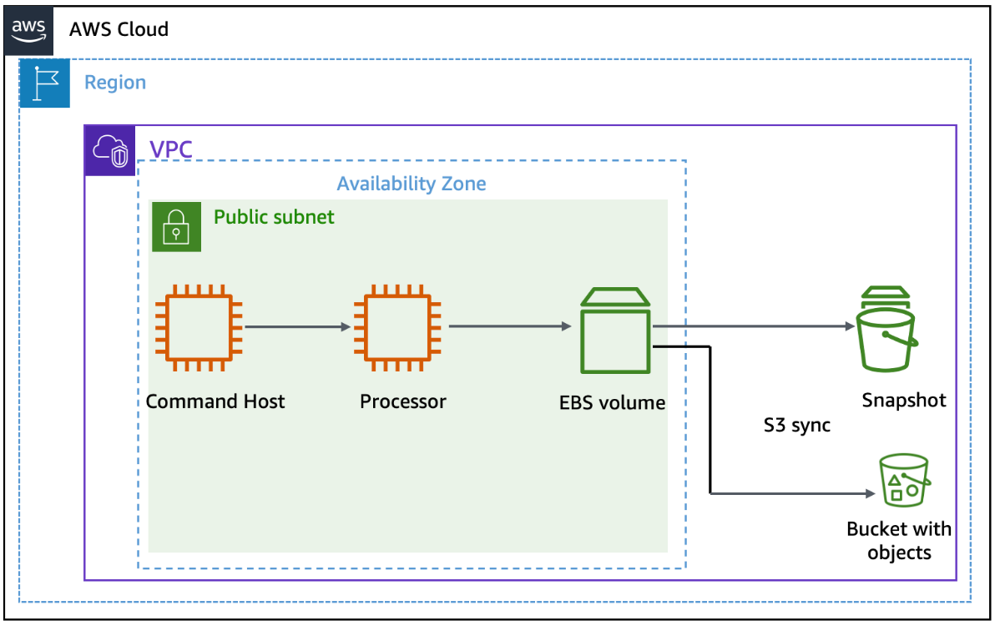

# Lab 07: Managing Storage with EBS Snapshots and S3 Sync

# 📘 **Overview**

This lab was about managing data stored on Amazon EBS volumes — the kind that backs EC2 instances. I used the AWS CLI to create and manage snapshots, set up a quick cron scheduler to automate them, and synced files from my instance to an Amazon S3 bucket. Toward the end, I used versioning in S3 to bring a deleted file back to life.

──────────────────────────────

# 🎯 **Goal**

- Create and maintain EBS snapshots.
- Use `aws s3 sync` to copy files from an EBS volume to an S3 bucket.
- Recover deleted files through Amazon S3 versioning.

──────────────────────────────

# **Architecture Topology**



──────────────────────────────

# 🛠️ **Steps Performed**

### **Task 1: Creating and Configuring Resources**

I started in the AWS Management Console and opened **S3** to create a bucket for syncing files later.

I named it something unique, hit **Create bucket**, and kept the region as default.


📌 | This is the indication that the bucket was successfully created, this is the Volume ID not the Bucket Name.

Then I switched to **EC2**, selected the **Processor** instance, and attached an IAM role called `S3BucketAccess`. That role allowed the instance to communicate with S3 and EBS without manual access keys.


📌 | Just like in the Bucket  creation  save this for later, also notice the “i-” its for instance.

──────────────────────────────

### **Task 2: Taking and Managing Snapshots**

### **Connecting to the Command Host**

Connected to the *Command Host* instance using **EC2 Instance Connect**. This became my control hub for running all the automation and CLI commands.

──────────────────────────────

### **Taking an Initial Snapshot**

Identified which EBS volume was attached to the *Processor* instance. Once I had its Volume ID, I noted the instance ID as well.

Before taking the snapshot, I stopped the instance to ensure data consistency. After creating the snapshot via CLI, I started the instance again.


📌 | This JSON holds everything a person needed to know about the snapshot, always make sure the state is completed

──────────────────────────────

### **Scheduling Automatic Snapshots**

Next, I created a temporary cron job that triggered the snapshot command every minute for testing. I piped it into a cron file, installed it, and watched new snapshots appear in the list after a few minutes.

```jsx
echo "* * * * *  aws ec2 create-snapshot --volume-id vol-049fa2b8dff0475ef 2>&1 >> /tmp/cronlog" > cronjob
crontab cronjob
```

──────────────────────────────

### **Keeping Only the Two Most Recent Snapshots**

Once I had several snapshots, I deleted the cron job and ran a Python script named `snapshotter_v2.py`.

The script sorted the snapshots by date and deleted all but the two newest ones.


📌 | This is the screenshot of the script, don’t run it using just “python” specify the version.


──────────────────────────────

### **Task 3: Syncing Files with Amazon S3**

For the challenge portion, I connected to the *Processor* instance again.

I downloaded a small zip file, extracted it, and prepared a `files/` directory for syncing.

Before running the sync, I enabled versioning on my S3 bucket with a single CLI command. Then I executed `aws s3 sync` to upload the local files to the bucket — three files transferred successfully.

📌 | The lab requires me to use `aws s3 sync` to mirror local data into S3, ensuring everything on the instance is safely backed up.

Next, I deleted one file locally and re-ran the sync with the `--delete` flag. S3 automatically reflected the change and removed the file as well.

To restore it, I checked the S3 object versions, copied the version ID of the deleted file, and restored it using another CLI command. When I synced again, the file reappeared with a new version.

📌 | The lab requires me to test versioning recovery to demonstrate how deleted files can be restored from earlier object versions.

──────────────────────────────

# 📝 **Key Takeaways**

- Automating snapshots ensures consistent data protection.
- `snapshotter_v2.py` effectively maintains snapshot retention.
- Cron jobs provide a lightweight approach to AWS automation.
- `aws s3 sync` and S3 versioning together create a simple yet robust backup loop.
- File recovery through versioning proves how easily AWS can reverse human error.

──────────────────────────────