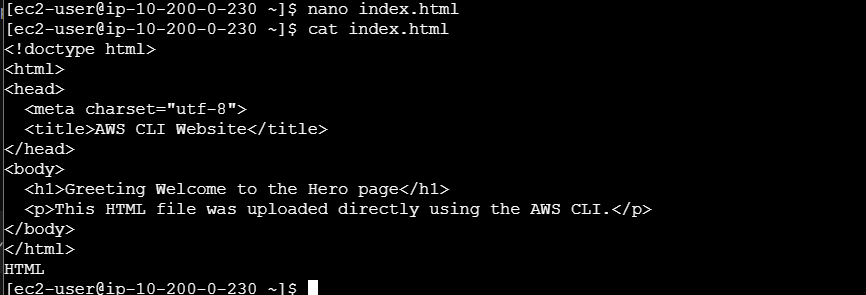
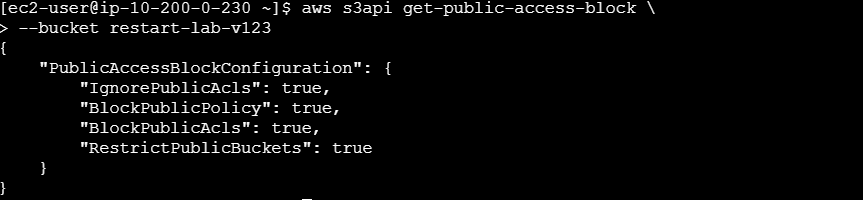
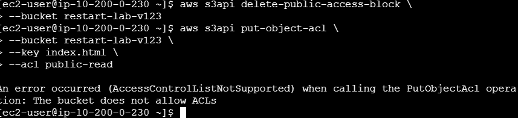

# Lab 10: S3 Bucket and Public Access Policy

## 📘 **Overview**

This lab demonstrates how to configure public access to an object in an Amazon S3 bucket using a bucket policy. It replaces the legacy ACL approach that is disabled when bucket ownership is set to `BucketOwnerEnforced`.

## 🎯 **Goal**

To make an S3 object publicly accessible by applying a bucket policy instead of using Access Control Lists (ACLs).

## 🧰 **Tools Used**

- AWS CLI
- Amazon S3
- Linux command line (nano text editor)

---

## 🛠️ **Steps Performed**

**Step 1: Create an S3 Bucket**

```bash
aws s3api create-bucket --bucket restart-lab-v123 --region us-west-2

```

📌 | The lab requires the bucket name to be globally unique and without underscores.

---

**Step 2: Upload an HTML File to the Bucket**

```bash
nano index.html

```

Add simple HTML content and save the file, then upload it:

```bash
aws s3 cp index.html s3://restart-lab-v123/

```

---

**Step 3: Verify Bucket Ownership Settings**

Check if ACLs are disabled due to the `BucketOwnerEnforced` configuration:

```bash
aws s3api get-bucket-ownership-controls --bucket restart-lab-v123

```

📘 **Overview**

This lab demonstrates how to make an S3 object publicly accessible using a bucket policy. The original attempt with ACLs failed due to the bucket’s `BucketOwnerEnforced` setting, which disables ACL functionality.

🎯 **Goal**

To enable public read access to an S3 object by removing restrictive public access settings and applying a bucket policy.

🧰 **Tools Used**

- AWS CLI
- Amazon S3
- Linux command line (nano text editor)

🗺️ **Architecture**

A single S3 bucket is used to host a static HTML file. The objective is to configure the bucket so that the file is accessible over the internet via a direct URL.

---

## 🛠️ **Steps Performed**

**Step 1: Create an S3 Bucket**

```bash
aws s3api create-bucket --bucket restart-lab-v123 --region ap-southeast-1

```

📌 | The lab requires the bucket name to be globally unique and contain no underscores.

---

**Step 2: Upload an HTML File**

Create an HTML file:

```bash
nano index.html

```

Add a short HTML message, save, and upload it to S3:



📌 | Use cat to confirm everything was saved.

```bash
aws s3 cp index.html s3://restart-lab-v123/
```

---

**Step 3: Check Public Access Block Configuration**

```bash
aws s3api get-public-access-block --bucket restart-lab-v123

```

If the configuration shows that all public access settings are set to `true`, proceed to the next step to remove the restrictions.



📌 | Check the PublicAcls as it is needed to access the website over the internet

---

**Step 4: Remove Public Access Block Settings**

```bash
aws s3api delete-public-access-block --bucket restart-lab-v123

```

---

**Step 5: Create a Bucket Policy for Public Read Access**

Create a JSON file:

```bash
nano bucket-policy.json

```

Add the following policy:

```json
{
  "Version": "2012-10-17",
  "Statement": [
    {
      "Sid": "PublicReadGetObject",
      "Effect": "Allow",
      "Principal": "*",
      "Action": "s3:GetObject",
      "Resource": "arn:aws:s3:::restart-lab-v123/*"
    }
  ]
}
```

Apply it:

```bash
aws s3api put-bucket-policy --bucket restart-lab-v123 --policy file://bucket-policy.json
```



📌 | Applying your own bucket policy will ensure that public acl could be set to read-only

---

**Step 6: Verify Public Object Access**

Access the uploaded file using its public URL:

```
https://restart-lab-v123.s3.ap-southeast-1.amazonaws.com/index.html
```

If successful, the page should load without requiring authentication.


---

📝 **Key Takeaways**

- Buckets with `BucketOwnerEnforced` ownership disable ACLs automatically.
- Public access settings must be removed before applying a bucket policy.
- Bucket policies provide a more secure and scalable access control method.
- Always confirm the access level after changes using the object’s public URL.