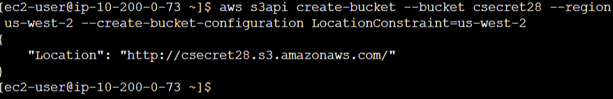
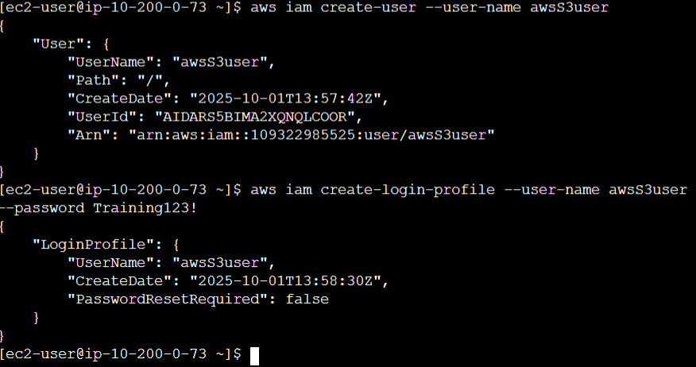
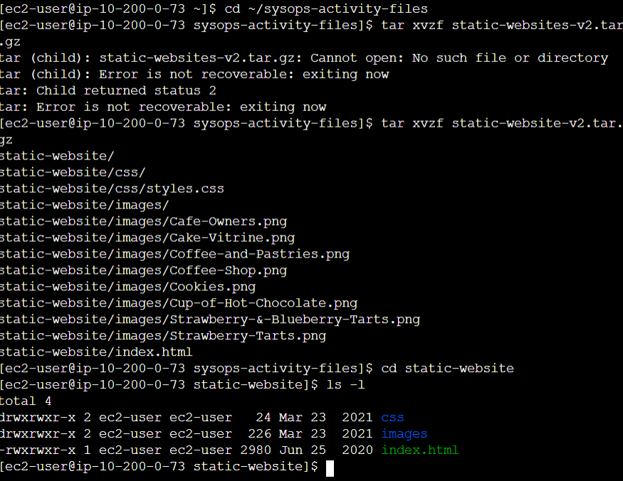

# Lab 01: Hosting a Static Website in Amazon S3 using AWS CLI

---

## 📘 Overview

I hosted a static website on **Amazon S3** using only the **AWS Command Line Interface (CLI)**.

This lab demonstrates how to host a static website using **Amazon S3** through the **AWS Command Line Interface (CLI)**.

The procedures include creating a bucket, configuring permissions, uploading website files, and automating updates through scripts.

---

## 🎯 Goal

Host a static website on Amazon S3 using only the AWS CLI by performing the following operations:

- Create an S3 bucket  
- Configure IAM permissions  
- Upload static website files  
- Automate deployment using scripts

---

## 🧰 Tools Used

- AWS CLI  
- Amazon S3  
- IAM (Identity and Access Management)  
- Amazon EC2 (Session Manager connection)

---

## 🗺️ Architecture

*(Insert architecture diagram here if applicable)*

---

## 🛠️ Steps Performed

### Step 1: Configure AWS CLI

Connect to the **Amazon Linux EC2 instance** through **Session Manager**. Configure the AWS CLI using provided credentials.

```bash
aws configure
```

Enter the following when prompted:

- Access Key ID  
- Secret Access Key  
- Region: us-west-2  
- Output format: json  

📌 | Ensure that the AWS CLI configuration completes successfully before proceeding.

---

### Step 2: Create an S3 Bucket

Create a unique S3 bucket in the `us-west-2` region.

```bash
aws s3api create-bucket \
  --bucket <unique-bucket-name> \
  --region us-west-2 \
  --create-bucket-configuration LocationConstraint=us-west-2
```

📌 | A successful response will include a “Location” field confirming the bucket creation.

---

### Step 3: Create an IAM User

Create an IAM user dedicated to managing S3 and attach the **AmazonS3FullAccess** policy.

```bash
aws iam create-user --user-name awsS3user
aws iam attach-user-policy \
  --policy-arn arn:aws:iam::aws:policy/AmazonS3FullAccess \
  --user-name awsS3user
```

📌 | Create the IAM user immediately after the bucket to maintain workflow. When logged in as `awsS3user`, console access will be limited.

Verify by signing in to the AWS Management Console using the new IAM credentials.

---

### Step 4: Configure S3 Permissions

Modify the S3 bucket’s public access settings:

- Disable **Block All Public Access**.  
- Enable **Access Control Lists (ACLs)** for **public read**.

📌 | This configuration is used only for the lab. In production, restrict public access to ensure security.

---

### Step 5: Upload Website Files

Extract the sample website files.

```bash
tar xvzf static-website-v2.tar.gz
```

Enable static website hosting on the bucket.

```bash
aws s3 website s3://<bucket-name>/ --index-document index.html
```

Upload files recursively with public read access.

```bash
aws s3 cp static-website/ s3://<bucket-name>/ --recursive --acl public-read
```

📌 | Use `ls -l` or `aws s3 ls s3://<bucket-name>/` to verify successful upload of all files.

---

### Step 6: Automate Website Updates

Create an automation script `update-website.sh` to simplify repetitive uploads.

```bash
#!/bin/bash
aws s3 cp ~/sysops-activity-files/static-website/ \
  s3://<bucket-name>/ --recursive --acl public-read
```

Make the script executable and run it.

```bash
chmod +x update-website.sh
./update-website.sh
```

📌 | Automation improves consistency in deployments and minimizes human error.

---

### Step 7: Optimize with AWS S3 Sync

Replace `cp` with `sync` to optimize uploads by only transferring changed files.

```bash
aws s3 sync ~/sysops-activity-files/static-website/ \
  s3://<bucket-name>/ --acl public-read
```

📌 | The `sync` command increases efficiency by reducing upload time.

---

## 📝 Key Takeaways

- S3 bucket names must be globally unique.  
- IAM users provide secure, isolated access.  
- Disabling public access is necessary for static sites but unsafe for production use.  
- Deployment automation ensures reliability and efficiency.  
- The `sync` command is faster and more efficient than `cp` for updates.  

---

## 🧩 Troubleshooting Knowledge Base

| Issue Number | Categories   | Issue Description                            | Symptoms | Root Cause Analysis | Resolution Procedures | Helpful Tools or Resources | Comments |
|--------------|---------------|----------------------------------------------|-----------|----------------------|------------------------|-----------------------------|-----------|
| 1 | Application | The provided Session Manager link in AWS details is incorrect | The link redirects to the console login page instead of the web-based shell | The link was incorrectly generated or copied from the AWS Lab environment | Manually connect to the Session Manager via the EC2 Console | EC2 Console |  |
