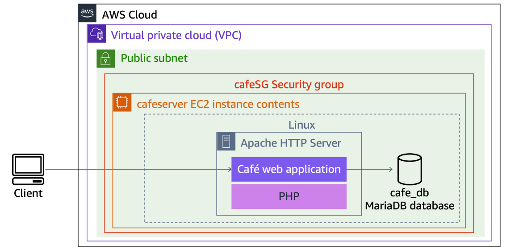
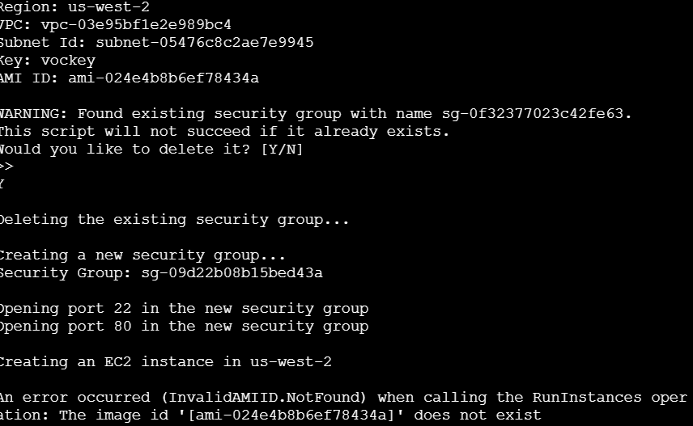
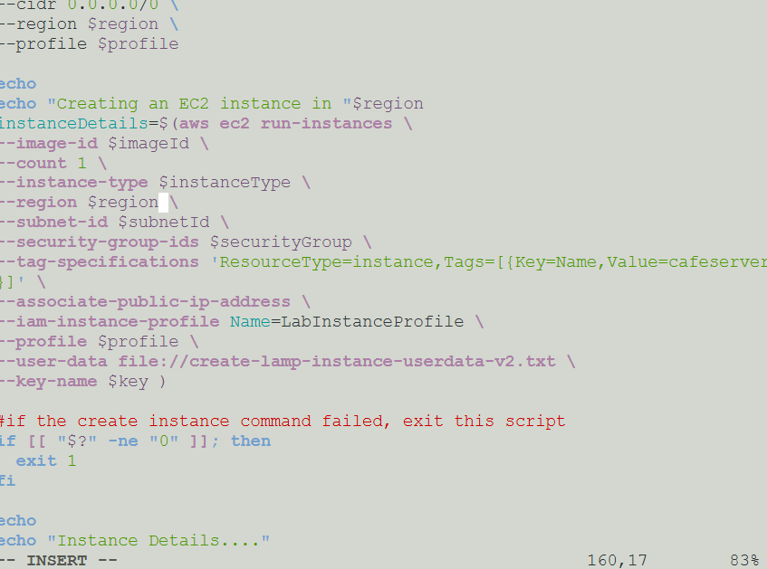
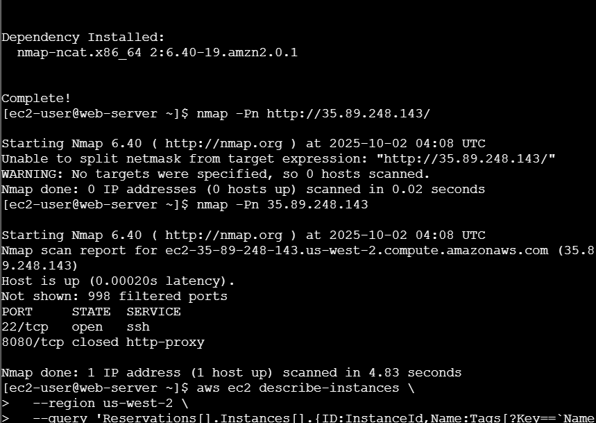
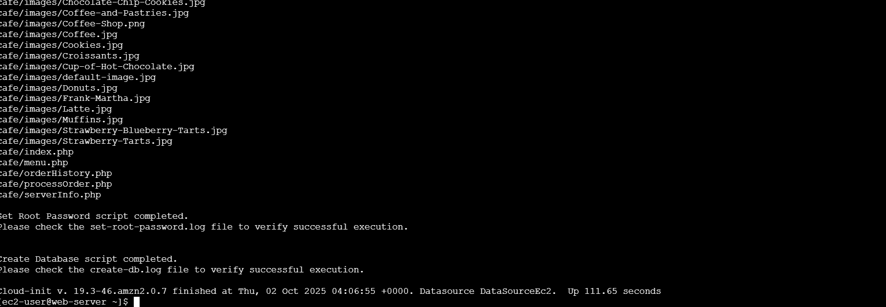
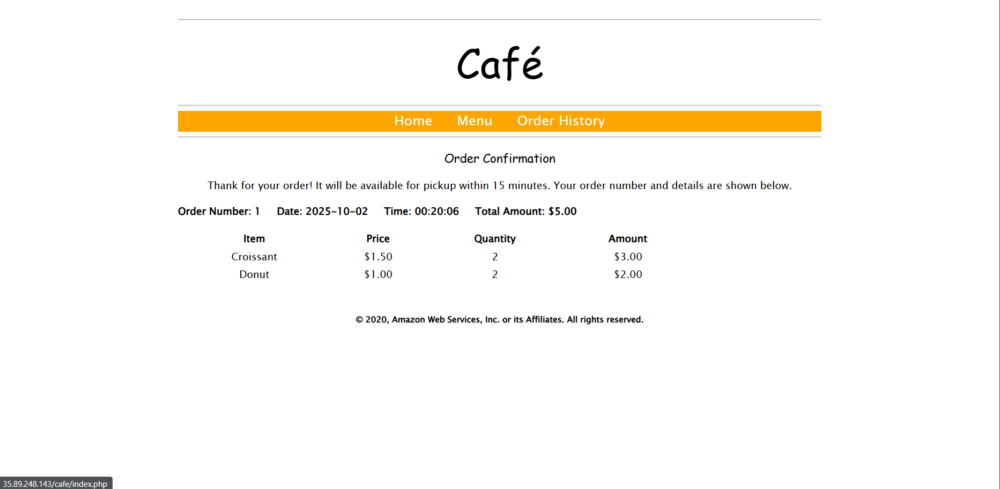

# **Lab 05: Troubleshooting an EC2 LAMP Deployment with AWS CLI**

## 📘 Overview

This deployment demonstrates how to automate a full LAMP environment using a user data script. It covers troubleshooting AMI mismatches, resolving connectivity issues, and verifying that both the web and database layers function correctly through the Café web app.

---

## 🎯 Goal

Deploy a complete **LAMP stack (Linux, Apache, MariaDB, PHP)** on an Amazon EC2 instance using the **AWS CLI**, and host the **Café Web Application**.

---

## 🧰 Tools Used

- **AWS CLI**
- **Amazon EC2**
- **Apache (HTTPD)**
- **MariaDB**
- **PHP**
- **nmap** (for port scanning and verification)

---

## Architecture

A single EC2 instance running the full LAMP stack, publicly accessible via HTTP (port 80). The web server hosts the Café web app and connects locally to the MariaDB database.



---

## 🛠️ Steps Performed

### Step 1: Environment Setup

- Connected to the **CLI Host** instance.
- Configured the **AWS CLI** using provided credentials.
- Executed the provided **shell script** to launch and configure the EC2 LAMP instance.

📌 | The instance initialization relied on user data to automate installation and configuration of Apache, PHP, and MariaDB.

### User Data Script

```bash
#!/bin/bash
yum -y update
amazon-linux-extras install -y lamp-mariadb10.2-php7.2 php7.2
yum -y install httpd mariadb-server

systemctl enable httpd
systemctl start httpd

systemctl enable mariadb
systemctl start mariadb

echo '<html><h1>Hello From Your Web Server!</h1></html>' > /var/www/html/index.html
find /var/www -type d -exec chmod 2775 {} \;
find /var/www -type f -exec chmod 0664 {} \;
echo "<?php phpinfo(); ?>" > /var/www/html/phpinfo.php

usermod -a -G apache ec2-user
chown -R ec2-user:apache /var/www
chmod 2775 /var/www

# Download and configure Café application files
wget https://aws-tc-largeobjects.s3.amazonaws.com/CUR-TF-100-RESTRT-1/173-activity-JAWS-troubleshoot-instance/db-v2.tar.gz
tar -zxvf db-v2.tar.gz

wget https://aws-tc-largeobjects.s3.amazonaws.com/CUR-TF-100-RESTRT-1/173-activity-JAWS-troubleshoot-instance/cafe-v2.tar.gz
tar -zxvf cafe-v2.tar.gz -C /var/www/html/

cd db
./set-root-password.sh
./create-db.sh
hostnamectl set-hostname web-server

```

📌 | Errors and progress can be reviewed in `/var/log/cloud-init-output.log`.

---

### Step 2: Troubleshooting Deployment Issues

### Issue 1: Invalid AMI ID

**Error:**

```bash
InvalidAMIID.NotFound

```



**Root Cause:**

The AMI ID referenced in the script did not exist in the current AWS region. It was hardcoded for `us-east-2`, but deployment occurred in `us-west-2`.

**Resolution:**

Replaced the hardcoded AMI ID with a dynamic `$region` variable to ensure compatibility across regions.



📌 | Note: Always verify that the AMI ID used in scripts exists in the active region before deployment.

---

### Issue 2: Web Application Inaccessible

**Symptom:** The public IP returned no response after instance launch.

**Troubleshooting Process:**

- Ran a port scan using `nmap` on the instance public IP.
    
    ```bash
    nmap <public-ip>
    ```
    
    
    
    Result: Port 80 was **closed**.
    
- Checked **Security Group inbound rules**. Port 80 was missing.
- Added an inbound rule for **HTTP (port 80)**.

After updating the security group, the web page loaded successfully.

📌 | Note: Security group misconfigurations are a common cause of connectivity failures. Always verify inbound and outbound rules early.

---

### Step 3: Verifying Setup

To confirm that user data executed properly:

```bash
sudo cat -f /var/log/cloud-init-output.log

```

Apache, MariaDB, and PHP installations completed without error. The Café web app and database scripts were successfully initialized.

Testing the web interface confirmed that dessert orders were recorded and reflected correctly in the **Order History**, verifying database connectivity.



📌 | Note: Cloud-init logs are the most reliable way to confirm user data execution on EC2.



---

## 📝 Key Takeaways

- **AMI IDs are region-specific** — use variables or parameterized inputs for portability.
- **Security Groups** must include correct inbound rules (especially for HTTP/HTTPS).
- **`nmap`** is a practical tool for verifying network accessibility.
- **Cloud-init logs** provide essential feedback on automated setup scripts.

## Troubleshooting Knowledge Base

| Issue Number | Categories | Issue Description | Symptoms | Root Cause Analysis | Resolution Procedures | Helpful Tools or Resources | Comments |
| --- | --- | --- | --- | --- | --- | --- | --- |
| 1 | Presentation | InvalidAMIID.NotFound | The Script stop running issuing an echo of the problem  | Hardcoded the wrong region for the EC2 | Assign a variable to the region to ensure the right  argument is inputted |  |  |
| 2 | Application | Website won’t load | The website screen shows a “Error can’t connect” | HTTP is not in the Inbound Rules of the Security Group | Allow HTTP in the Security Group with the Source “IP4v anywhere | Using NMAP on the provided Public IP address |  |
