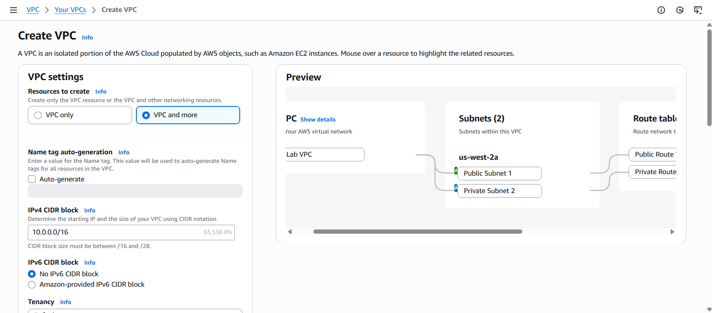
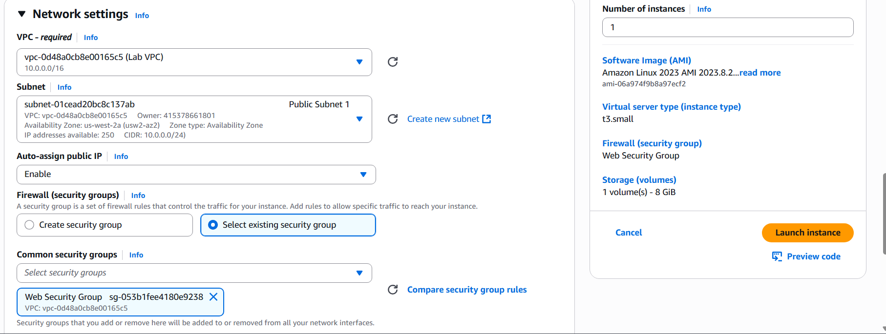
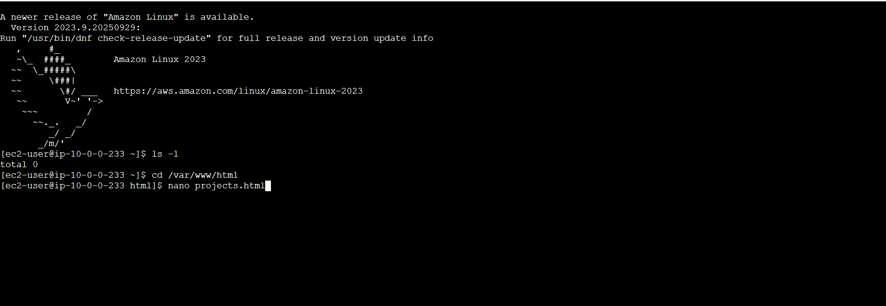
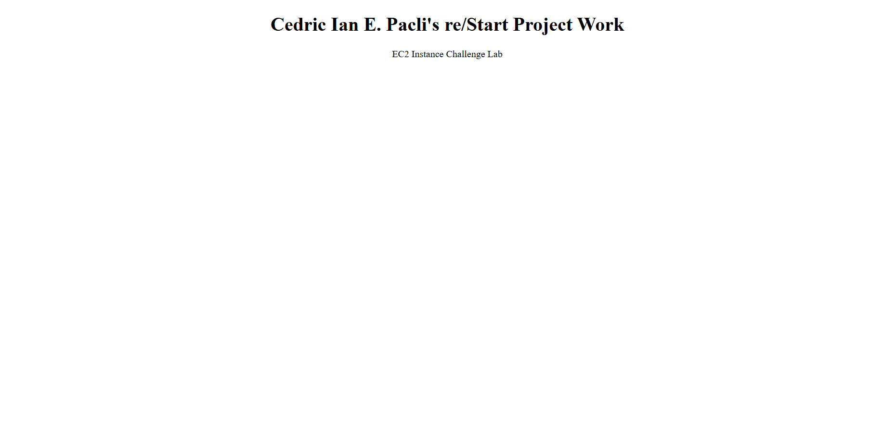

# Lab 02: Create a VPC with Public/Private Subnets and Deploy a Web Server on EC2

## 📘 **Overview**

This documentation outlines the process of creating a custom **Amazon Virtual Private Cloud (VPC)** with one **public** and one **private** subnet within a single Availability Zone. The setup includes configuring routing through an **Internet Gateway (IGW)** and **NAT Gateway**, defining **security groups** for HTTP and SSH access, and deploying an **Amazon EC2** instance running an **Apache web server** using user data automation.

---

## 🎯 **Goal**

To host a simple web application in a secure and segmented network environment by designing a custom VPC with public and private subnets, enabling controlled routing and internet access.

---

## 🧰 **Tools Used**

- AWS Management Console
- Amazon VPC
- Internet Gateway (IGW)
- NAT Gateway
- Amazon EC2
- Security Groups
- User Data (Shell Script)

---

## 🗺️ **Architecture**

| Component | Configuration | Purpose |
| --- | --- | --- |
| **VPC** | 10.0.0.0/16 | Custom isolated network |
| **Public Subnet** | 10.0.0.0/24 (<availability zone>) | Hosts EC2 and NAT Gateway |
| **Private Subnet** | 10.0.1.0/24 (<availability zone>) | For backend or restricted resources |
| **Internet Gateway** | Attached to VPC | Enables outbound and inbound connectivity |
| **NAT Gateway** | Located in Public Subnet | Provides outbound internet access for private subnet |
| **Route Tables** | Public → IGW / Private → NAT | Controls routing behavior |
| **Security Group** | Allows HTTP (80) & SSH (22) | Defines access permissions for EC2 instance |

---

## 🛠️ **Steps Performed**

### **Step 1: Create the Custom VPC**

1. Open the **VPC console** and create a new VPC using CIDR block `10.0.0.0/16`.
2. Create two subnets:
    - Public Subnet: `10.0.0.0/24`
    - Private Subnet: `10.0.1.0/24`
        
        Both in the same Availability Zone for simplified routing.
        
3. Attach an **Internet Gateway** to the VPC.
4. Create a **NAT Gateway** in the public subnet.
5. Configure **Route Tables**:
    - Public Route Table → route `0.0.0.0/0` to the Internet Gateway
    - Private Route Table → route `0.0.0.0/0` to the NAT Gateway
        
        
        
        📌 | Suggestion: You can make the other components manually connect them later but using VPC and more is much faster
        

---

### **Step 2: Configure the Security Group**

1. Create a **Web Security Group** in the same VPC.
2. Add inbound rules:
    - **HTTP (80)** — Source: Anywhere (IPv4)
    - **SSH (22)** — Source: Anywhere (IPv4)

📌 | The lab requires enabling both HTTP and SSH for accessibility and verification. In production environments, SSH access should be restricted to trusted IPs only.

---

### **Step 3: Launch the EC2 Instance**

1. Launch an **Amazon Linux 2** instance within the **Public Subnet**.
2. Configure the instance with:
    - Instance Type: `t3.micro`
    - Storage: General Purpose SSD (gp2)
    - Auto-assign Public IPv4: Enabled
    - Security Group: Web Security Group
        
        
        
        📌 | Note: Always verify that the EC2 is in the proper VPC and Subnet and if  the auto assign IP is needed make sure to check it as this will be harder to configure after the EC2 has been launched
        
3. Under **Advanced Details**, add the following user data script to automate Apache installation:

```bash
#!/bin/bash
yum update -y
yum install -y httpd
systemctl start httpd
systemctl enable httpd
chmod -R 777 /var/www/html

```

📌 | The use of `chmod 777` is for temporary testing, as this was required in the lab. For production, apply least-privilege principles using `chown` or `chmod` with restricted access.

---

### **Step 4: Deploy the Web Page**

1. Connect to the instance using **EC2 Instance Connect**.
    
    
    
    📌 | Suggestion: To make it easier write the code to an external editor or IDE as this will help avoid syntax errors
    
2. Navigate to the Apache web root and create a new HTML file:

```bash
cd /var/www/html
nano projects.html

```

3. Add the following HTML content:

```html
<!DOCTYPE html>
<html>
  <body>
    <h1>Ced’s re/Start Project Work</h1>
    <p>EC2 Instance Challenge Lab</p>
  </body>
</html>

```

4. Save the file and verify deployment by entering the instance’s **public IPv4 address** (`<ip address>`) in a browser.

📌 | The lab requires using an external code editor for lengthy scripts to minimize syntax errors when copying to the console.

---

### **Step 5: Verification**

1. Open a browser and verify that the webpage is accessible through the instance’s public IPv4 address.
2. Run the following command to confirm Apache is active:

```bash
systemctl status httpd

```

3. Confirm:
    - HTTP and SSH are the only open inbound ports.
    - Public subnet routes to the IGW.
    - Private subnet routes to the NAT Gateway.
    
    
    

---

## 📝 **Key Takeaways**

- Proper subnet segmentation enhances both **security** and **network efficiency**.
- **Internet and NAT Gateways** establish controlled inbound/outbound connectivity.
- Automating setup via **User Data** improves repeatability and reduces manual errors.
- Testing permissions like `chmod 777` should never be used in production.
- Restrict SSH access to specific IP addresses to maintain security best practices.

---

# Troubleshooting Knowledge Base

| Issue Number | Categories | Issue Description | Symptoms | Root Cause Analysis | Resolution Procedures | Helpful Tools or Resources | Comments |
| --- | --- | --- | --- | --- | --- | --- | --- |
| 1 | Networking | EC2 Instance Connect SSH connection blocked | EC2 Instance Connect pop upped a warning “No SSH connection” | As the issue already stated  SSH is the problem, port 22 could be blocked or misconfigured in the Security Group | Check the Security Group if the SSH (22) is enabled in “Inbound”, check if its properly setup with the right source |  | is the source directed to “your IP address only”? Try Changing it to “Any IPv4 address” |
